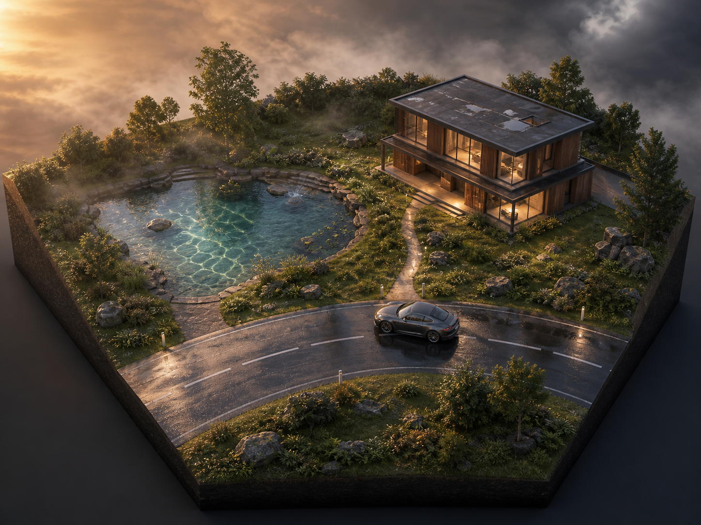
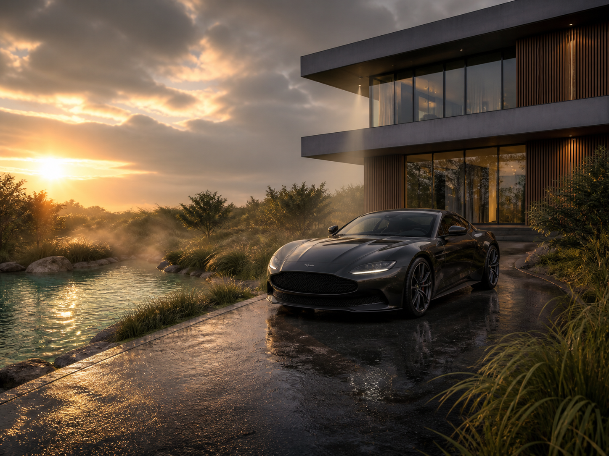

# 小型室外效果展示场景设计

## 1. 场景定位

这是一个约 **60m × 45m** 的小型单镜头展示场景，不是完整街区，也不追求可自由探索的大地图。

场景只保留四个主要体块：

- 一段约 45m 长的弧形道路
- 一个约 18m × 12m 的浅水池
- 一栋约 18m × 12m 的两层现代建筑
- 一辆作为视觉中心的 PBR 汽车

程序化草地、体积云、体积雾、焦散和湿地面围绕这四个主体服务，避免做成彼此分离的效果演示区。

## 2. 视觉参考

### 俯视布局



### 主视角



图片用于确定体块关系、比例和气氛，不要求逐项复刻植被和建筑细节。

## 3. 平面布局

以场地中心为 Unity 世界原点，X 轴为东西方向，Z 轴为南北方向。

```text
                              北 +Z

       草坡和边界植被（高度 1.5m～3m）
    ┌──────────────────────────────────┐
    │                                  │
    │   小水池              现代建筑   │
    │  18m × 12m           18m × 12m  │
    │   ~~~~~~~~        ┌──────────┐   │
    │  ~ 焦散区 ~ ─步道─│ 玻璃立面 │   │
    │   ~~~~~~~~        └──────────┘   │
    │       草地      汽车 ★            │
    │             ╭────────╮           │
    │            ╱  弧形道路 ╲          │
    │           ╱             ╲         │
    └──────────────────────────────────┘

       主相机位于西南侧，朝东北方向观察
                              南 -Z
```

### 建议坐标

| 对象 | 中心坐标 | 尺寸/说明 |
|---|---:|---|
| 场地 | `(0, 0, 0)` | `60m × 45m` |
| 建筑 | `(15, 0, 10)` | `18m × 12m`，总高约 7.5m |
| 水池 | `(-14, -0.3, 8)` | `18m × 12m`，最深约 1.2m |
| 汽车 | `(5, 0.15, -4)` | 朝 Y 轴旋转约 `-25°` |
| 主相机 | `(-18, 1.4, -18)` | 35–45mm 等效视角，朝向汽车 |
| 太阳 | 西南偏西 | 高度角约 `18°～25°` |

坐标只用于快速灰盒，可以根据车型和建筑资产尺寸整体缩放 10%～20%。

## 4. 主画面构图

主相机采用低机位三分构图：

- 汽车位于画面右侧三分线，是第一视觉中心。
- 水池占画面左下区域，水面负责承接夕阳并展示水下焦散。
- 建筑占右上区域，用玻璃、混凝土和木格栅给车漆提供结构化反射。
- 草地位于汽车、水池与场地边界之间，隐藏有限的场景尺寸。
- 天空约占画面上方三分之一，为体积云留出表现空间。

不要在汽车正后方放复杂的小物件。车身轮廓应主要落在建筑暗面或雾气较淡的区域，以保证剪影清晰。

## 5. 各效果的空间安排

### 水池与焦散

- 建筑一侧使用规整浅水台阶，草坡一侧使用自然石岸。
- 焦散主要投射到浅色池底、台阶立面和两三块水下石头上。
- 水深从靠镜头一侧的 0.15m 逐渐过渡到中央约 1.2m。
- 水边只放少量草和石块，保留能看清焦散的干净区域。

### 程序化草地

- 草只覆盖水池外圈、建筑侧边和道路前景，不铺满整个场地。
- 道路边使用短草，水边使用湿润深色草，边界使用较高草丛。
- 用 3～5 个风区或扰动源制造不同节奏，避免所有草同步摆动。
- 场地边缘通过高草、灌木、石块和轻微抬高的地形隐藏终止线。

### PBR 车漆

- 汽车停在道路弯曲处，让车身同时反射天空、水面、建筑与暗色植被。
- 推荐深灰、墨绿或深蓝色金属漆，Clear Coat 高光更容易保持高级感。
- 车旁不要堆放路灯、路牌等高对比物体，以免反射过碎。
- 湿路面反射强度低于车漆，避免画面所有表面都一样亮。

### 体积雾

- 水面上方布置一层很薄的局部雾，高度控制在 0.2m～1.2m。
- 建筑悬挑和草坡之间可以有一束可见光，但不要让整个场景充满浓雾。
- 汽车附近保持清晰，雾主要用于分离水池、草地和远端边界。

### 体积云

- 主云体放在画面右上方或正上方，左侧夕阳附近留出云隙。
- 云影可以缓慢扫过草地和建筑，但主镜头下汽车最好保持半明半暗。
- 云层运动方向与草的主风向保持一致。

### 建筑与街道光照

- 一栋小建筑就足够表现室外建筑光照，不再扩展商业街。
- 首层采用玻璃与深色内空间，二层采用浅色混凝土和木格栅。
- 檐口、立柱和台阶制造硬阴影；玻璃与室内暖光制造冷暖对比。
- 建筑内部只需要一个可见房间，不需要完整室内。

## 6. 光照气氛

建议使用“雨后傍晚、云层正在散开”的固定时刻：

- 主光为暖色低角度太阳，从画面左侧进入。
- 天空环境光偏冷，填充建筑阴影和车身暗部。
- 路面保留局部湿润区域，不要整条道路像镜子。
- 建筑室内使用少量暖光，亮度只需足够透过玻璃可见。
- 后处理以自然曝光为主，避免 Bloom 掩盖车漆和焦散细节。

## 7. 灰盒搭建顺序

1. 建立 `60m × 45m` 地面和轻微起伏的草坡。
2. 用样条或简单网格做出一段弧形道路。
3. 用立方体搭建单栋两层建筑。
4. 挖出水池并建立浅水台阶。
5. 放入汽车替代模型和主相机。
6. 固定太阳角度，检查汽车、水池、建筑的三角构图。
7. 构图确认后再制作水、草、车漆、体积云和体积雾。
8. 最后补充石块、灌木、路桩和少量室内灯光。

## 8. 范围控制

为确保它始终是小场景，建议明确限制：

- 不增加第二栋主建筑。
- 不增加完整街区或远景城市。
- 不把水池扩大成湖。
- 不制作超过 50m 的可行驶道路。
- 树木控制在 8～12 棵，主要用于遮挡边界。
- 主镜头确认前不进入细节资产制作。

最终目标是一张完成度高的主画面，以及在主画面附近小范围移动仍然成立的环境，而不是开放世界关卡。
